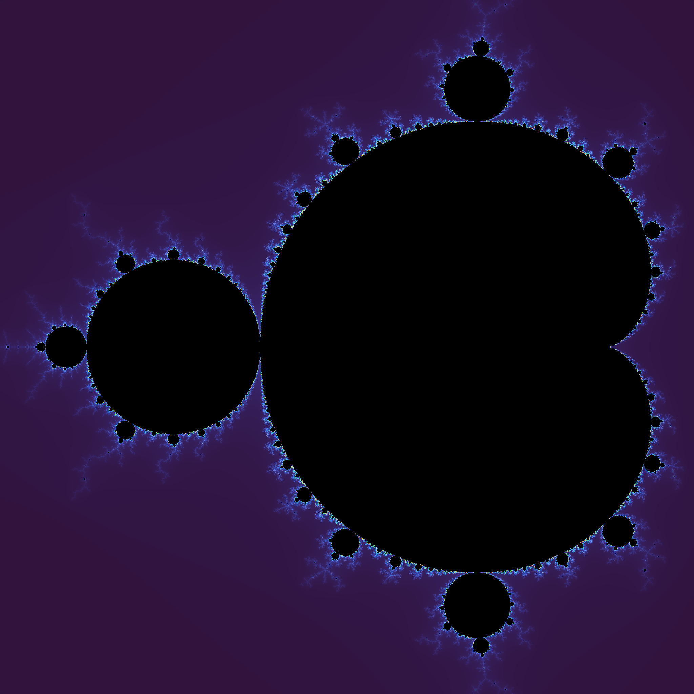
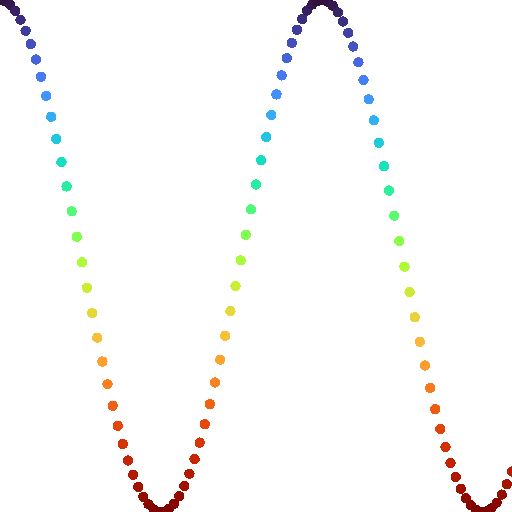

# CS100 2025 Spring Recitations

## Introduction

以下是每次复习课的补充材料。虽然它们是非官方的实验性内容，并且与作业、quiz、考试没有任何关系，甚至我们每次只会在复习课的最后简单提一嘴，但它们绝对是实用且规范的好例子。我们设计它们的初衷是希望各位能一边享受 C/C++ 编程，一边丰富自己的工程经验。不妨关闭 Copilot 之类的 AI 工具，一行一行地对着代码抄一遍，会有所收获的。

为了保证代码简洁、可读，我们只完全兼容了 Windows，存在一些实现无法在 Linux 等操作系统上直接运行。但请不要慌，这些小问题都是相当好解决的，比如只需要删除 `.exe` 这些后缀即可。如果您碰到难以解决的问题，我们随时欢迎反馈。

## Supp 1: Hello Painter

我们将学习如何使用 `printf` 来作画。


## Supp 2: Hello Primitive

我们将学习如何在图上画圆、椭圆、长方形。


## Supp 3: Hello Fractal

我们将学习如何绘制[分形](https://en.wikipedia.org/wiki/Fractal)。



## Supp 4: Hello Animation

我们将学习如何制作[动画](r4/supp/video_high_quality.mp4)。



## Supp 5: Hello Macro

我们将学习如何实现强大、实用的宏，例如让同一个宏能够接收不同数量的参数、做不同的事情。
```c
// 接收一个参数。
MY_ASSERT(a == 1);
// 接收两个参数，第二个参数是失败时会打印的信息。
MY_ASSERT(a == 1, "杂鱼♥～杂鱼♥～，才不会告诉你 `a` 应该等于 1 呢♥");
```

## Supp 6: Hello RAII

**最重要的一集，必看！**

如果您问，C++ 最重要的基础知识点是什么，我们会毫不犹豫地回答 [RAII (Resource Acquisition Is Initialization)](https://en.cppreference.com/w/cpp/language/raii)，甚至它可能是 C++ 和 C 最本质的差异之一。因此，我们决定在最开头就介绍它，这会和官方的教学风格有所不同。但请放心，我们会尽量用最简洁、易懂的方式来介绍这个重要概念。

我们将学习如何使用 RAII 自动地管理“资源”，例如如何自动 `free` 那些 `malloc` 出来的内存，而永远不必担心会忘记释放它们。甚至，即使有[异常 (exception)](https://en.cppreference.com/w/cpp/error/exception)参与时，也永远不会出现内存泄漏。

```cpp
// Instantiate a memory guard with a dynamic array of 10 `int`s.
// The memory is now OWNed by `guard`.
MemoryGuard guard{(int *)malloc(10 * sizeof(int))};

// Get a non-OWNing pointer of the dynamic array.
// "Non-OWNing" means that we should not call `free` on it.
int *const ptr = guard.ptr;

//! This technique is called RAII (Resource Acquisition Is Initialization).
//! Recall that `guard` OWNs the dynamic array during initialization.
//! In this example, memory is the resource.
//! RAII is almost the most important programming technique for C++!
```

## Supp 7: Hello Legacy

**第二重要的一集，必看！**

中国有句古话叫做，祖宗之法不可变。我们将学习一系列 C++ 臭名昭著的天坑、历史遗留问题、设计缺陷。请务必将它们铭记在心并且尽量避免它们出现。

```cpp
//! 有一只怪东西混入了其中，猜猜它是谁？
SomeClass v0;  
SomeClass v1();
SomeClass v2{};
SomeClass v3(10);
SomeClass v4{10};
SomeClass v5(10.0);
SomeClass v6{10.0};

//! 有一只怪东西试图伪装得和大家都很像，猜猜它是谁，又如何识破它呢？
std::vector<char> vec0;
std::vector<int> vec1;
std::vector<bool> vec2;
std::vector<float> vec3;
std::vector<double> vec4;
```
